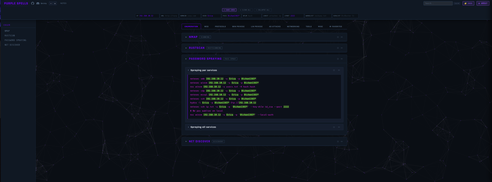
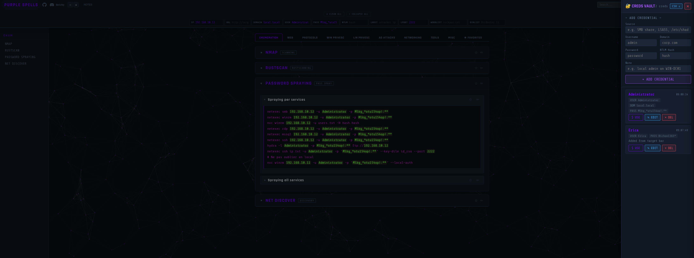
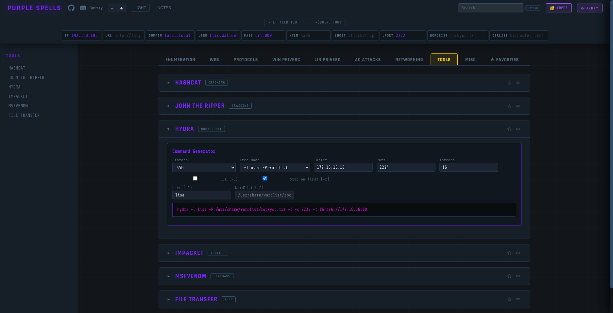
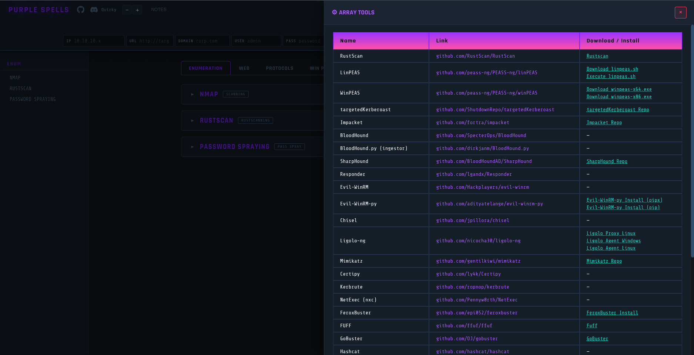
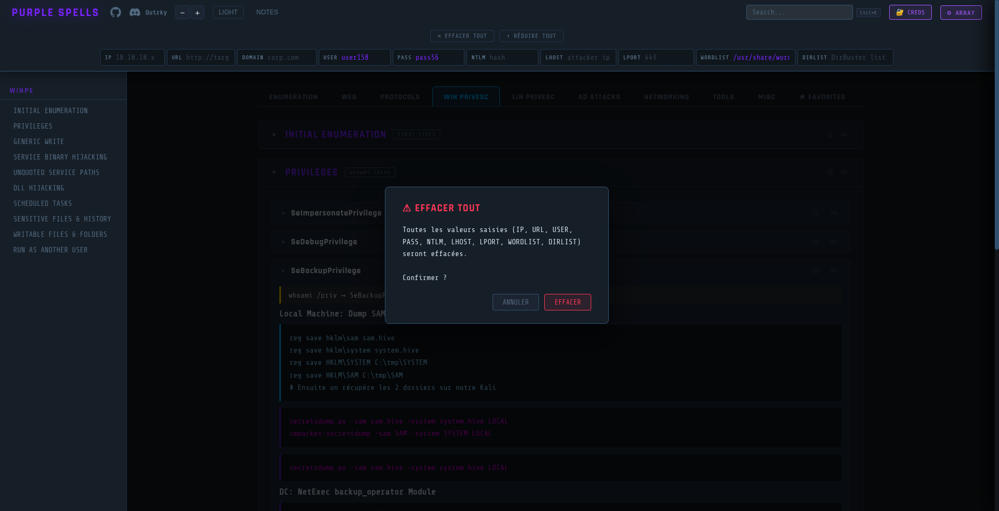
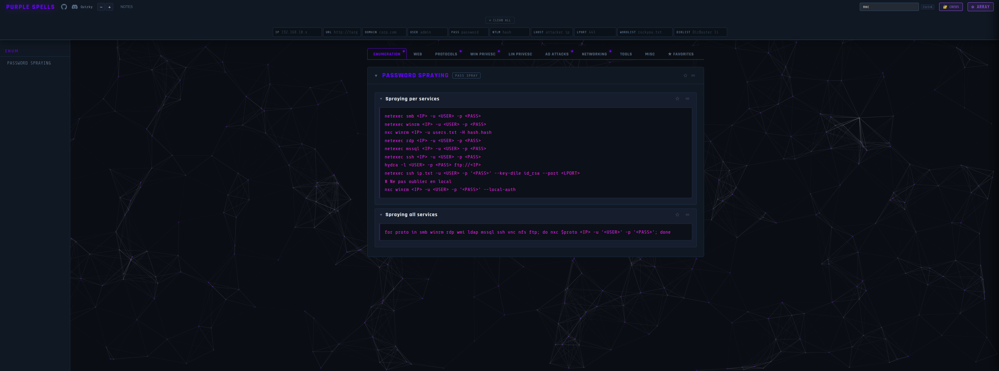

# PURPLE SPELLS 🟣

  

An offensive cheatsheet and interactive tool, designed for pentesters and CTF enthusiasts.  

___  

## Overview

**Purple Spells** is an all-in-one tool for offensive security. It brings together commands, techniques and generators in a web interface, organized by tabs, with dynamic variables that are automatically injected into all commands.  

| Main | Creds |
|----------------|-------|
|  |  |

| Generator | Array tools |
|-----------|-------------|
|  |  |

| Clear All | Search |
|-----------|--------|
|  |  |
___  

## Features

### 🎯 Dynamic Variable Bar
Enter your target variables once at the top of the interface (IP, URL, DOMAIN, USER, PASS, NTLM, LHOST, LPORT, WORDLIST, DIRLIST) — they are automatically substituted into **all** commands in the cheatsheet.  

### 🔐 Creds Vault
A dedicated side panel for storing harvested credentials (source, user, domain, pass, NTLM hash, note). The **USE** button directly injects credentials into the variable bar. CSV export available.  

### ⭐ Favorites
Each section and sub-section can be bookmarked (★). The **FAVORITES** tab lists all your favorites for instant access. Persisted in localStorage.  

### 📝 Notes
Persistent note-taking panel (button **NOTES**), saved in localStorage.  

### 🔍 Search
Real-time search across all sections. `Escape` clears the search and restores the collapsed state.  

### 🧰 Array Tools
A summary table of all tools referenced in the cheatsheet with their direct GitHub links (RustScan, LinPEAS, WinPEAS, BloodHound, Mimikatz, Impacket, Chisel, Ligolo-ng, Hydra, Hashcat, NetExec, Evil-WinRM, Responder, and others). Accessible via the **ARRAY TOOLS** button.  

### 🎨 Theme & Zoom
- **Dark / light** theme (THEME button), persisted
- Font size adjustment **− / +** (12–20px), persisted

### 🛠️ Built-in Command Generators
- **Hydra** — brute-force with protocol selection, credentials, form data
- **MSFvenom** — payload generation (type, format, LHOST, LPORT, output file)
- **Hashcat** — hash cracking (mode, file, wordlist, rules, --force)

___  

## Tabs

| Tab | Content |
|---|---|
| **ENUMERATION** | Nmap, RustScan, Password Spraying |
| **WEB** | Dir Enum, SQLi, XSS, LFI/RFI, File Upload, Command Injection |
| **PROTOCOLS** | SMB, DNS, FTP, SNMP, SMTP, MSSQL, MySQL, SSH, RDP, WinRM, NFS, POP3, PostgreSQL, Rsync, SQLite |
| **WIN PRIVESC** | Initial Enum, Privileges (SeImpersonate, SeDebug, SeBackup, SeRestore…), Services, Registry, etc. |
| **LIN PRIVESC** | SUID, Sudo, Cron, Capabilities, etc. |
| **AD ATTACKS** | Kerberoasting, AS-REP, Pass-the-Hash/Ticket, BloodHound, DCSync, Lateral Movement (nxc, PsExec, WMI, DCOM, RDP…) |
| **NETWORKING** | Ping/Port sweep, Tunneling (SSH, Ligolo, Chisel, dnscat2) |
| **TOOLS** | RevShells (iframe), Hydra / MSFvenom / Hashcat generators |
| **MISC** | Miscellaneous |
| **★ FAVORITES** | All your favorited sections |

___  

## Usage

### Source Code  
```bash
# Clone the repo
git clone https://github.com/Quirky1869/purple-spells.git

# Open the file in your browser
xdg-open ./purple-spells/Purple-Spells.html
# or
firefox ./purple-spells/Purple-Spells.html
# or
google-chrome ./purple-spells/Purple-Spells.html
```

> Works entirely locally — no connection required (except the RevShells iframe and Google Fonts).

<h3>  
  Docker  
  <a href="https://www.docker.com/" target="_blank" rel="noreferrer">  
      
  </a>  
</h3>  

|Docker (Dockerfile)|Docker compose (docker-compose.yml)|  
|----------|--------------|
|docker build . -t purple|  docker compose up  |
|docker run -d -p 9999:80 purple||

Go to : http://127.0.0.1:9999  
____  

## Author

Project developed by **Quirky**
